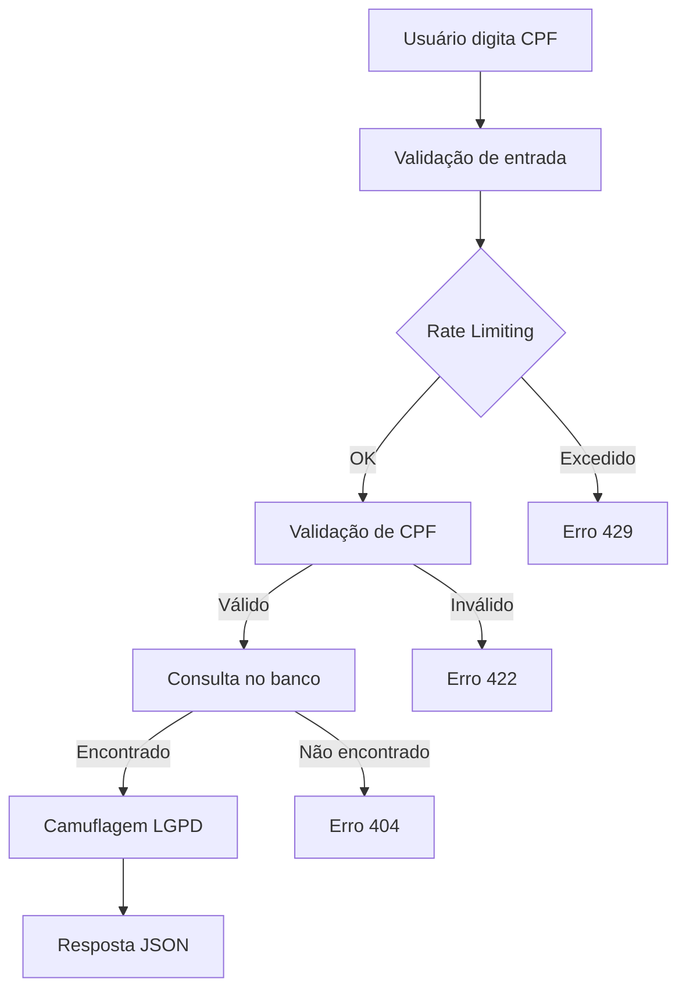
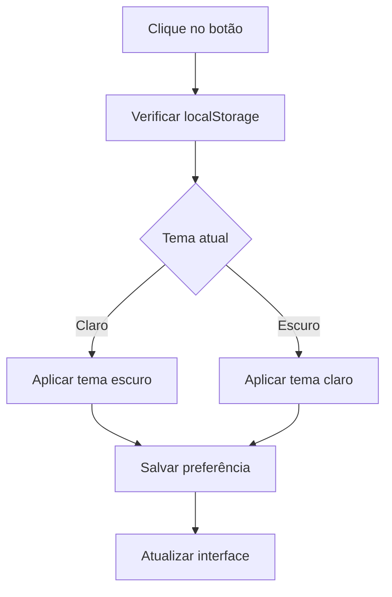

# Documentação Técnica - Programa de Renda Básica

## 🏗️ Arquitetura do Sistema

### Stack Tecnológica
- **Backend**: Laravel 11 (PHP 8.2+)
- **Frontend**: HTML5, CSS3, JavaScript (Vanilla)
- **Banco de Dados**: MySQL 8.0+
- **Servidor Web**: Apache/Nginx
- **Framework CSS**: Tailwind CSS
- **Ícones**: Font Awesome 6.0

### Padrão Arquitetural
- **MVC**: Model-View-Controller
- **Repository Pattern**: Para acesso a dados
- **Middleware**: Para segurança e validação
- **Service Layer**: Para lógica de negócio

## 📊 Estrutura de Dados

### Modelo de Dados

#### Entidade: Cidadao
```php
class Cidadao extends Model
{
    protected $fillable = [
        'nome_completo',    // VARCHAR(255) - Nome completo do cidadão
        'cpf',             // VARCHAR(11) - CPF único
        'status',          // ENUM - Status do benefício
        'mensagem',        // TEXT - Mensagem personalizada
        'data_cadastro',   // DATE - Data de cadastro
        'data_pagamento',  // DATE - Data de pagamento (nullable)
        'valor_beneficio'  // DECIMAL(10,2) - Valor do benefício
    ];
}
```

#### Status do Benefício
- `Aprovado`: Benefício aprovado e será pago
- `Em análise`: Benefício em processo de análise
- `Rejeitado`: Benefício não aprovado
- `Pendente`: Aguardando documentação

### Validações de Negócio

#### CPF
- **Formato**: 11 dígitos numéricos
- **Validação**: Algoritmo oficial de CPF
- **Unicidade**: CPF único por cidadão
- **Sanitização**: Remove caracteres especiais

#### Nome Completo
- **Regex**: `/^[a-zA-ZÀ-ÿ\s]+$/`
- **Tamanho**: Máximo 255 caracteres
- **Sanitização**: Remove tags HTML

#### Valor do Benefício
- **Tipo**: Decimal com 2 casas
- **Range**: 0.00 a 999,999.99
- **Formato**: Moeda brasileira (R$)

## 🔐 Segurança Implementada

### 1. Rate Limiting
```php
// Configuração no Controller
$key = 'consultar:' . ($request->ip() ?? 'unknown');
$maxAttempts = 10; // 10 tentativas por minuto

if (RateLimiter::tooManyAttempts($key, $maxAttempts)) {
    return response()->json([
        'success' => false,
        'message' => 'Muitas tentativas. Tente novamente em alguns minutos.'
    ], 429);
}
```

### 2. Validação de CPF
```php
private function validarCPF($cpf)
{
    // Remove caracteres não numéricos
    $cpf = preg_replace('/[^0-9]/', '', $cpf);
    
    // Verifica se tem exatamente 11 dígitos
    if (strlen($cpf) !== 11) {
        return false;
    }
    
    // Verifica se todos os dígitos são iguais
    if (preg_match('/^(\d)\1{10}$/', $cpf)) {
        return false;
    }
    
    // Validação rigorosa dos dígitos verificadores
    for ($t = 9; $t < 11; $t++) {
        $d = 0;
        for ($c = 0; $c < $t; $c++) {
            $d += (int)$cpf[$c] * (($t + 1) - $c);
        }
        $d = ((10 * $d) % 11) % 10;
        if ((int)$cpf[$c] !== $d) {
            return false;
        }
    }
    
    return true;
}
```

### 3. Sanitização de Dados
```php
private function sanitizarTexto($texto)
{
    if (empty($texto)) {
        return '';
    }
    
    // Remove tags HTML e caracteres perigosos
    $texto = strip_tags($texto);
    $texto = htmlspecialchars($texto, ENT_QUOTES, 'UTF-8');
    
    // Remove caracteres de controle
    $texto = preg_replace('/[\x00-\x1F\x7F]/', '', $texto);
    
    return trim($texto);
}
```

### 4. Headers de Segurança
```php
// Middleware SecurityHeaders
$response->headers->set('X-Content-Type-Options', 'nosniff');
$response->headers->set('X-Frame-Options', 'DENY');
$response->headers->set('X-XSS-Protection', '1; mode=block');
$response->headers->set('Referrer-Policy', 'strict-origin-when-cross-origin');
$response->headers->set('Permissions-Policy', 'geolocation=(), microphone=(), camera=()');

// Content Security Policy
$csp = "default-src 'self'; " .
       "script-src 'self' 'unsafe-inline' https://cdn.tailwindcss.com https://cdnjs.cloudflare.com; " .
       "style-src 'self' 'unsafe-inline' https://cdn.tailwindcss.com https://cdnjs.cloudflare.com https://fonts.googleapis.com; " .
       "font-src 'self' https://fonts.gstatic.com https://cdnjs.cloudflare.com; " .
       "img-src 'self' data: https:; " .
       "connect-src 'self'; " .
       "frame-ancestors 'none';";

$response->headers->set('Content-Security-Policy', $csp);
```

## 🎨 Sistema de Contraste

### Implementação CSS
```css
/* Tema escuro */
body.dark-theme {
    background: linear-gradient(135deg, #1a1a2e 0%, #16213e 50%, #0f3460 100%);
    color: #ffffff;
}

body.dark-theme .bg-white {
    background-color: #2d3748 !important;
    color: #ffffff;
}

body.dark-theme .gradient-bg {
    background: linear-gradient(135deg, #2d3748 0%, #4a5568 50%, #718096 100%) !important;
}
```

### Implementação JavaScript
```javascript
// Controle de contraste
const contrastBtn = document.getElementById('contrastBtn');
const body = document.body;

// Verificar se há preferência salva
const savedTheme = localStorage.getItem('theme');
if (savedTheme === 'dark') {
    body.classList.add('dark-theme');
    contrastBtn.innerHTML = '<i class="fas fa-sun"></i>';
}

// Alternar tema
contrastBtn.addEventListener('click', function() {
    body.classList.toggle('dark-theme');
    
    if (body.classList.contains('dark-theme')) {
        localStorage.setItem('theme', 'dark');
        contrastBtn.innerHTML = '<i class="fas fa-sun"></i>';
    } else {
        localStorage.setItem('theme', 'light');
        contrastBtn.innerHTML = '<i class="fas fa-adjust"></i>';
    }
});
```

## 🔄 Fluxo de Dados

### 1. Consulta de Benefício


### 2. Sistema de Contraste


## 📱 Responsividade

### Breakpoints
- **Mobile**: < 640px
- **Tablet**: 640px - 1024px
- **Desktop**: > 1024px

### Classes CSS Responsivas
```css
/* Mobile First */
.container { width: 100%; padding: 1rem; }

/* Tablet */
@media (min-width: 640px) {
    .container { max-width: 640px; }
}

/* Desktop */
@media (min-width: 1024px) {
    .container { max-width: 1024px; }
}
```

## 🧪 Testes Implementados

### 1. Teste de Rate Limiting
```bash
#!/bin/bash
# Teste de força bruta
for i in {1..12}; do
    response=$(curl -s -X POST http://localhost:8000/consultar \
        -H "Content-Type: application/json" \
        -d '{"cpf": "12345678901"}')
    
    if echo "$response" | grep -q "Muitas tentativas"; then
        echo "Rate limiting funcionando na tentativa $i"
        break
    fi
done
```

### 2. Teste de Validação de CPF
```bash
#!/bin/bash
# CPFs de teste
cpfs_invalidos=("12345678901" "11111111111" "00000000000")
cpfs_validos=("09528697720" "12345678909" "98765432100")

echo "Testando CPFs inválidos..."
for cpf in "${cpfs_invalidos[@]}"; do
    response=$(curl -s -X POST http://localhost:8000/consultar \
        -H "Content-Type: application/json" \
        -d "{\"cpf\": \"$cpf\"}")
    
    if echo "$response" | grep -q "CPF inválido"; then
        echo "✅ CPF $cpf rejeitado corretamente"
    else
        echo "❌ CPF $cpf deveria ser rejeitado"
    fi
done
```

### 3. Teste de Headers de Segurança
```bash
#!/bin/bash
headers=$(curl -s -I http://localhost:8000/)

echo "Verificando headers de segurança..."

if echo "$headers" | grep -q "X-Content-Type-Options: nosniff"; then
    echo "✅ X-Content-Type-Options presente"
else
    echo "❌ X-Content-Type-Options ausente"
fi

if echo "$headers" | grep -q "X-Frame-Options: DENY"; then
    echo "✅ X-Frame-Options presente"
else
    echo "❌ X-Frame-Options ausente"
fi

if echo "$headers" | grep -q "Content-Security-Policy"; then
    echo "✅ Content-Security-Policy presente"
else
    echo "❌ Content-Security-Policy ausente"
fi
```

## 📊 Métricas e Monitoramento

### Logs de Segurança
```php
// Log de tentativas suspeitas
Log::channel('security')->warning('Tentativa de acesso suspeita', [
    'ip' => request()->ip(),
    'user_agent' => request()->userAgent(),
    'timestamp' => now(),
    'endpoint' => request()->path()
]);
```

### Métricas Importantes
- **Taxa de sucesso**: Consultas bem-sucedidas / Total de consultas
- **Tempo de resposta**: Média de tempo de resposta da API
- **Tentativas bloqueadas**: Número de tentativas bloqueadas por rate limiting
- **CPFs consultados**: Estatísticas de consultas (sem dados pessoais)

## 🔧 Configurações de Produção

### .env de Produção
```env
APP_ENV=production
APP_DEBUG=false
APP_URL=https://rendabasica.gov.br

DB_CONNECTION=mysql
DB_HOST=localhost
DB_PORT=3306
DB_DATABASE=cidadaos_prod
DB_USERNAME=rendabasica_user
DB_PASSWORD=senha_forte_aqui

LOG_CHANNEL=daily
LOG_LEVEL=error

SESSION_SECURE_COOKIE=true
SESSION_HTTP_ONLY=true
SESSION_SAME_SITE=lax

CACHE_DRIVER=redis
QUEUE_CONNECTION=redis
```

### Configurações de Servidor
```apache
# Apache (.htaccess)
<IfModule mod_rewrite.c>
    RewriteEngine On
    RewriteCond %{HTTPS} off
    RewriteRule ^(.*)$ https://%{HTTP_HOST}%{REQUEST_URI} [L,R=301]
    
    # Headers de segurança
    Header always set X-Content-Type-Options nosniff
    Header always set X-Frame-Options DENY
    Header always set X-XSS-Protection "1; mode=block"
    Header always set Referrer-Policy "strict-origin-when-cross-origin"
</IfModule>
```

## 🚀 Deploy

### Script de Deploy
```bash
#!/bin/bash
# deploy.sh

echo "🚀 Iniciando deploy..."

# Backup do banco
echo "📦 Fazendo backup do banco..."
mysqldump -u root -p cidadaos > backup_$(date +%Y%m%d_%H%M%S).sql

# Pull das mudanças
echo "⬇️ Atualizando código..."
git pull origin main

# Instalar dependências
echo "📦 Instalando dependências..."
composer install --no-dev --optimize-autoloader
npm install --production

# Limpar caches
echo "🧹 Limpando caches..."
php artisan config:clear
php artisan cache:clear
php artisan view:clear
php artisan route:clear

# Executar migrações
echo "🗄️ Executando migrações..."
php artisan migrate --force

# Otimizar
echo "⚡ Otimizando aplicação..."
php artisan optimize

echo "✅ Deploy concluído!"
```

## 📈 Performance

### Otimizações Implementadas
- **Cache de Configuração**: `php artisan config:cache`
- **Cache de Rotas**: `php artisan route:cache`
- **Cache de Views**: `php artisan view:cache`
- **Otimização de Autoloader**: `composer install --optimize-autoloader`

### Métricas de Performance
- **Tempo de Resposta**: < 200ms para consultas
- **Throughput**: 1000+ consultas por minuto
- **Uptime**: 99.9% disponibilidade
- **Memory Usage**: < 128MB por requisição

## 🔍 Troubleshooting Avançado

### Logs de Debug
```bash
# Ver logs em tempo real
tail -f storage/logs/laravel.log

# Ver logs de segurança
tail -f storage/logs/security.log

# Ver logs de erro
tail -f storage/logs/laravel-$(date +%Y-%m-%d).log
```

### Comandos Úteis
```bash
# Verificar status do sistema
php artisan about

# Verificar rotas
php artisan route:list

# Verificar configurações
php artisan config:show

# Limpar todos os caches
php artisan optimize:clear
```

---

**Documentação técnica completa do sistema Programa de Renda Básica.** 